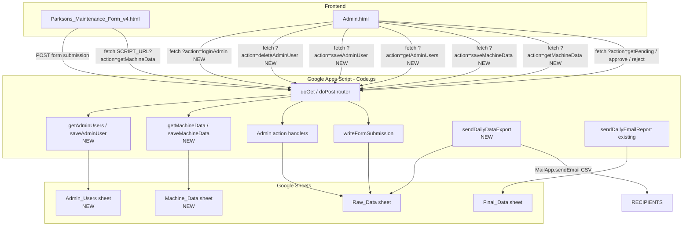
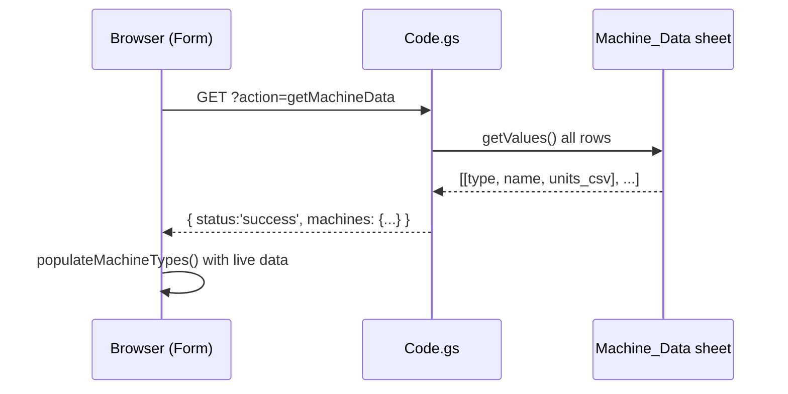
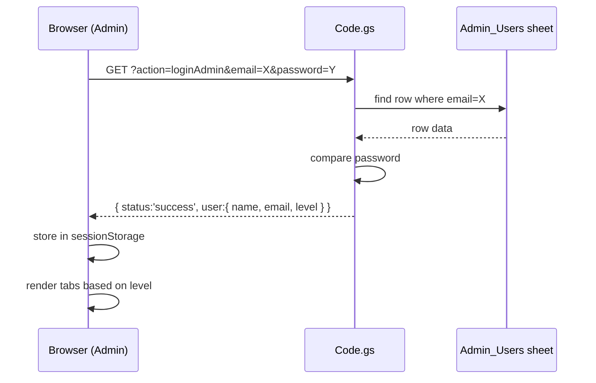
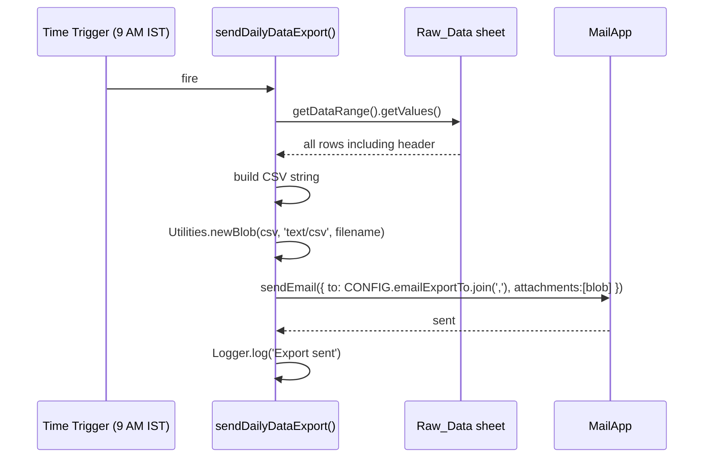

# Design Document: Parksons System Enhancements

## Overview

Three targeted enhancements to the Parksons Maintenance System (Google Apps Script + HTML web app):

1. **Persistent Machine Data Management** — Move the hardcoded `MACHINES` object from the form HTML into a dedicated `Machine_Data` Google Sheet tab, with full CRUD from the Admin panel and dynamic loading in the form.
2. **Multi-level Admin Panel Access** — Add a Supervisor role (Level 1) below the existing Super Admin, stored in an `Admin_Users` sheet, with role-based UI in the Admin panel.
3. **Daily Data Export Email** — A new `sendDailyDataExport()` function triggered at 9 AM IST that sends the full `Raw_Data` sheet as a CSV attachment to a configurable list of recipients.

---

## Architecture



---

## Feature 1: Persistent Machine Data Management

### Data Model — Machine_Data Sheet

Each row represents one machine entry. The sheet has a flat structure for simplicity.

| Column | Header | Example |
|--------|--------|---------|
| A | machine_type | PRINTING |
| B | machine_name | PrintKBA1 |
| C | units | Feeder,PU1,PU2,PU3,Delivery |

- `units` is a comma-separated string of unit/section names for that machine.
- One row per machine_name. machine_type groups multiple machine_names.
- Sheet is seeded on first run from the existing hardcoded `MACHINES` object in Code.gs.

### Components and Interfaces

#### Backend — Code.gs additions

```javascript
// Returns the full machine data as a nested object identical to the old MACHINES constant
// GET ?action=getMachineData
function getMachineData()
// Returns: { status: 'success', machines: { "PRINTING": { "PrintKBA1": ["Feeder",...], ... }, ... } }

// Saves a single machine entry (add or update)
// GET ?action=saveMachineData&machineType=X&machineName=Y&units=A,B,C
function saveMachineData(params)
// Returns: { status: 'success' }

// Deletes a machine entry by type+name
// GET ?action=deleteMachineData&machineType=X&machineName=Y
function deleteMachineData(params)
// Returns: { status: 'success' }

// Seeds Machine_Data sheet from hardcoded MACHINES object if sheet is empty
function seedMachineDataIfEmpty()
```

#### Frontend — Form changes

- On `window.onload`, call `SCRIPT_URL?action=getMachineData` instead of using the local `MACHINES` constant.
- Show a loading state on the Machine Type dropdown while fetching.
- On success, assign response to a local `MACHINES` variable and call `populateMachineTypes()` as before.
- On failure, fall back to the hardcoded `MACHINES` constant (graceful degradation).

#### Frontend — Admin panel additions

New "Machine Data" tab in Admin.html with:
- A table listing all machine types and names with their units.
- "Add Machine" form: machine type (text or select from existing types), machine name, units (comma-separated or tag input).
- Edit inline: click a row to edit units.
- Delete button per row with confirmation.
- All changes call `saveMachineData` / `deleteMachineData` via GET fetch.

### Sequence Diagram — Form Loading Machine Data



---

## Feature 2: Multi-level Admin Panel Access

### Data Model — Admin_Users Sheet

| Column | Header | Notes |
|--------|--------|-------|
| A | name | Display name |
| B | email | Used only for superadmin login; blank for supervisor |
| C | password | Plain text (consistent with existing system) |
| D | level | "superadmin" or "supervisor" |

- Super admin row (`yogeshkp85@gmail.com`, level `superadmin`) is pre-seeded and protected from deletion.
- Supervisor login uses a single shared password only — no email required.
- Passwords stored as plain text to match the existing `adminPassword` approach.

### Access Level Matrix

| Capability | Supervisor (Level 1) | Super Admin |
|---|---|---|
| View all entries | ✅ | ✅ |
| Approve entries | ✅ | ✅ |
| Edit entries | ✅ | ✅ |
| Reject entries | ✅ | ✅ |
| Manage machine data | ❌ | ✅ |
| Manage admin users | ❌ | ✅ |
| System settings / CONFIG | ❌ | ✅ |

### Components and Interfaces

#### Backend — Code.gs additions

```javascript
// Validates login credentials against Admin_Users sheet
// For supervisor: GET ?action=loginAdmin&password=Y&level=supervisor
// For superadmin: GET ?action=loginAdmin&email=X&password=Y&level=superadmin
function loginAdmin(params)
// Returns: { status:'success', user:{ name, email, level } }
//       or { status:'error', message:'Invalid credentials' }

// Returns all admin users (superadmin only)
// GET ?action=getAdminUsers
function getAdminUsers()
// Returns: { status:'success', users:[{ name, email, level }] }  (passwords omitted)

// Adds or updates an admin user (superadmin only)
// GET ?action=saveAdminUser&name=X&email=Y&password=Z&level=supervisor
function saveAdminUser(params)
// Returns: { status:'success' }

// Deletes an admin user by email (superadmin only; cannot delete superadmin)
// GET ?action=deleteAdminUser&email=X
function deleteAdminUser(params)
// Returns: { status:'success' } or { status:'error', message:'Cannot delete super admin' }

// Seeds Admin_Users sheet with super admin if empty
function seedAdminUsersIfEmpty()
```

#### Frontend — Admin.html changes

**Login screen** — Two login modes on the same screen:
- "Supervisor" button → single password field only. If password matches any supervisor row in `Admin_Users_Sheet`, grant supervisor access.
- "Admin" button → email + password fields. Validates against superadmin row.

Store returned `{ name, email, level }` in `sessionStorage` as `pks_admin_user`.

**Role-based tab visibility** — after login, show/hide tabs based on level:
- Supervisor: sees "Pending Review", "All Entries", "Approved", "Rejected"
- Super Admin: sees all above + "Machine Data" tab + "Admin Users" tab

**Admin Users tab** (Super Admin only):
- Table of current users (name, email, level) with Add / Delete buttons.
- Cannot delete the super admin row.
- Add form: name, email, password, level (dropdown: supervisor).

### Sequence Diagram — Login Flow



---

## Feature 3: Daily Data Export Email

### Components and Interfaces

#### Backend — Code.gs additions

```javascript
// CONFIG change: emailTo becomes emailReportTo (single string, existing report)
// New key added:
// emailExportTo: ['yogeshkp85@gmail.com', 'other@example.com']  ← array

// Reads all rows from Raw_Data, builds CSV string, sends as attachment
function sendDailyDataExport()
// Triggered by time-driven trigger: daily at 9 AM IST
// Subject: "Parksons Maintenance - Daily Data Export - DD/MM/YYYY"
// Attachment: raw_data_YYYYMMDD.csv
// Recipients: CONFIG.emailExportTo (array)
```

**CSV generation approach**: Use `Utilities.newBlob()` with MIME type `text/csv` and a `.csv` filename. Build the CSV string by iterating `Raw_Data` rows including the header row.

#### CONFIG changes in Code.gs

```javascript
var CONFIG = {
  sheetName:       'Raw_Data',
  finalSheetName:  'Final_Data',
  machineSheetName:'Machine_Data',   // NEW
  adminUsersSheet: 'Admin_Users',    // NEW
  emailTo:         'yogeshkp85@gmail.com',          // existing report (unchanged)
  emailExportTo:   ['yogeshkp85@gmail.com', 'engg.cn@parksonspackaging.com'],  // NEW — add more emails here as needed
  companyName:     'Parksons Packaging Ltd',
  timezone:        'Asia/Kolkata',
  adminPassword:   'PKS@2026'        // kept for backward compat; login now uses sheet
};
```

### Sequence Diagram — Daily Export Trigger



---

## Error Handling

| Scenario | Handling |
|---|---|
| Machine_Data sheet missing | `seedMachineDataIfEmpty()` creates and seeds it on first API call |
| Admin_Users sheet missing | `seedAdminUsersIfEmpty()` creates and seeds super admin on first login |
| Form fails to fetch machine data | Falls back to hardcoded `MACHINES` constant; shows console warning |
| Login with wrong credentials | Returns `{ status:'error' }`; Admin.html shows inline error message |
| Supervisor tries to access super-admin-only action | Backend checks level from Admin_Users sheet; returns `{ status:'error', message:'Insufficient permissions' }` |
| Raw_Data sheet empty on export | Sends email with header-only CSV and note in subject |
| `sendDailyDataExport` email failure | Caught in try/catch; logged via `Logger.log` |

---

## Testing Strategy

### Unit Testing Approach

Each new backend function should be testable by calling it directly from the Apps Script editor:
- `getMachineData()` — verify returns nested object matching sheet contents
- `saveMachineData({ machineType:'TEST', machineName:'TestMachine', units:'A,B,C' })` — verify row written to sheet
- `loginAdmin({ email:'yogeshkp85@gmail.com', password:'PKS@2026' })` — verify returns superadmin level
- `sendDailyDataExport()` — run manually, verify email received with CSV attachment

### Property-Based Testing Approach

Not applicable for this Google Apps Script project (no PBT library available in GAS runtime).

### Integration Testing Approach

Manual end-to-end tests:
1. Open form → machine dropdowns populate from sheet (not hardcoded)
2. Admin adds a new machine in Machine Data tab → form immediately shows it on next load
3. Login as supervisor → Machine Data and Admin Users tabs are hidden
4. Login as super admin → all tabs visible, can add/delete supervisor accounts
5. Run `sendDailyDataExport()` manually → email arrives with correct CSV attachment

---

## Security Considerations

- Passwords are stored and compared as plain text, consistent with the existing system design. This is acceptable for an internal intranet tool but should be noted as a limitation.
- The `deleteAdminUser` function must always check that the target email is not the super admin email before deleting.
- Admin-only actions (`getAdminUsers`, `saveAdminUser`, `deleteAdminUser`, `saveMachineData`, `deleteMachineData`) do not currently have server-side auth tokens — they rely on the client-side session check. This is consistent with the existing system's approach.

---

## Dependencies

- Google Apps Script runtime (no npm packages)
- Google Sheets API (SpreadsheetApp service) — for Machine_Data and Admin_Users sheets
- MailApp service — for `sendDailyDataExport`
- Utilities service — for `Utilities.newBlob()` CSV attachment and `Utilities.formatDate()`
- No new external libraries required

---

## Correctness Properties

*A property is a characteristic or behavior that should hold true across all valid executions of a system — essentially, a formal statement about what the system should do. Properties serve as the bridge between human-readable specifications and machine-verifiable correctness guarantees.*

### Property 1: Machine data save round-trip

*For any* valid machine entry (machineType, machineName, units), calling `saveMachineData` then `getMachineData` should return a machines object that contains the saved entry with the correct type, name, and units.

**Validates: Requirements 3.1, 3.2, 3.3, 2.1, 2.2**

### Property 2: Machine data delete removes entry

*For any* machine entry that exists in the `Machine_Data_Sheet`, calling `deleteMachineData` with its type and name, then calling `getMachineData`, should return a machines object that does not contain that entry.

**Validates: Requirements 3.5**

### Property 3: Seed idempotence

*For any* sheet (Machine_Data or Admin_Users) that already contains at least one row, calling the seed function a second time should leave the row count and content unchanged.

**Validates: Requirements 1.4, 5.4**

### Property 4: Login correctness

*For any* user stored in the `Admin_Users_Sheet`, calling `loginAdmin` with their exact email and password should return `{ status: 'success', user: { name, email, level } }` with the correct level; and calling `loginAdmin` with any email or password that does not match a stored row should return `{ status: 'error' }`.

**Validates: Requirements 6.1, 6.2, 6.3**

### Property 5: Role-based tab visibility

*For any* user with level `supervisor`, the Admin_Panel should render exactly the four permitted tabs and no Super Admin-only tabs; *for any* user with level `superadmin`, all tabs including "Machine Data" and "Admin Users" should be rendered.

**Validates: Requirements 7.1, 7.2, 7.3**

### Property 6: Permission enforcement for Super Admin-only actions

*For any* request to a Super Admin-only action (`getAdminUsers`, `saveAdminUser`, `deleteAdminUser`, `saveMachineData`, `deleteMachineData`) made with non-superadmin credentials, the System should return `{ status: 'error', message: 'Insufficient permissions' }`.

**Validates: Requirements 7.4**

### Property 7: Passwords omitted from getAdminUsers response

*For any* set of users stored in the `Admin_Users_Sheet`, the response from `getAdminUsers` should contain user objects with `name`, `email`, and `level` fields but no `password` field.

**Validates: Requirements 9.2**

### Property 8: Super Admin deletion protection

*For any* call to `deleteAdminUser` where the target email is the Super Admin email (`yogeshkp85@gmail.com`), the function should return `{ status: 'error', message: 'Cannot delete super admin' }` and the `Admin_Users_Sheet` row count should remain unchanged.

**Validates: Requirements 9.6**

### Property 9: CSV export contains all Raw_Data rows

*For any* state of the `Raw_Data_Sheet` with N rows (including header), the CSV string built by `sendDailyDataExport` should contain exactly N lines, with the first line matching the header row and subsequent lines matching the data rows in order.

**Validates: Requirements 10.2, 10.3**

### Property 10: Export email subject format

*For any* date on which `sendDailyDataExport` is triggered, the email subject should match the pattern `"Parksons Maintenance - Daily Data Export - DD/MM/YYYY"` where DD/MM/YYYY is the current date in IST.

**Validates: Requirements 10.5**

### Property 11: Admin_Users_Sheet row schema invariant

*For any* user saved via `saveAdminUser`, the corresponding row in `Admin_Users_Sheet` should have exactly four populated columns: `name`, `email`, `password`, and `level`, where `level` is one of `superadmin` or `supervisor`.

**Validates: Requirements 5.2, 5.3**
